# Tender Intelligence System — Complete Architecture & Codebase Guide

> **Version:** 2.1 | **Client:** Mexel Energy Sustain | **Stack:** Python + Static PWA + SQLite
> **Last Updated:** 2026-04-05

---

## Table of Contents

1. [Executive Summary](#executive-summary)
2. [System Architecture](#system-architecture)
3. [Data Flow Pipeline](#data-flow-pipeline)
4. [Component Deep Dive](#component-deep-dive)
   - [Scraping Layer](#scraping-layer)
   - [Classification Engine](#classification-engine)
   - [Scoring Engine](#scoring-engine)
   - [Database Layer](#database-layer)
   - [Dashboard Frontend](#dashboard-frontend)
   - [Flask API](#flask-api)
   - [Automation & Scheduling](#automation--scheduling)
5. [Database Schema](#database-schema)
6. [Configuration & Environment](#configuration--environment)
7. [Security Model](#security-model)
8. [Testing & CI/CD](#testing--cicd)
9. [Deployment Architecture](#deployment-architecture)
10. [Developer Guide](#developer-guide)
11. [Glossary](#glossary)

---

## Executive Summary

The **Tender Intelligence System** is an automated tender discovery, classification, and scoring platform built for **Mexel Energy Sustain**, a South African thermal efficiency services company specializing in cooling water treatment, chemical dosing, and IoT-enabled monitoring for power generation, mining, and industrial clients.

### Business Purpose

The system solves three core problems:

1. **Discovery** — Automatically scrapes 11+ South African government, municipal, and state-owned enterprise (SOE) tender portals daily
2. **Filtering** — Classifies tenders using a three-profile keyword matching system to identify only those relevant to Mexel's core competencies
3. **Prioritization** — Scores qualified tenders using a composite algorithm (fit + industry value) to surface HIGH/MEDIUM/LOW priority opportunities

### Key Metrics

| Metric | Value |
|--------|-------|
| Data Sources | 11+ portals (municipalities, SOEs, National Treasury, water boards) |
| Scraping Methods | HTTP requests + BeautifulSoup, Selenium (headless Chrome), REST APIs |
| Classification Profiles | 3 (Profile A: Product, Profile B: System+Action, Exclusions) |
| Scoring Dimensions | 2 (Fit Score 60%, Industry Score 40%) |
| Priority Levels | 3 (HIGH ≥7.0, MEDIUM ≥4.5, LOW <4.5) |
| Dashboard | Static PWA with virtual scrolling, offline support, analytics |
| Storage | SQLite (primary), Excel (legacy compatibility) |
| Alerts | Email, Slack, SMS (Twilio) — all configurable |

---

## System Architecture

### High-Level Component Diagram

```mermaid
graph TB
    subgraph "Data Sources"
        A1[Municipalities<br/>Cape Town]
        A2[SOEs<br/>Eskom, Rand Water, Transnet, etc.]
        A3[National Treasury<br/>eTenders Portal]
        A4[Water Boards<br/>Umgeni, Magalies, Lepelle]
        A5[Joburg Water<br/>Selenium]
        A6[Eskom Bulletin<br/>API + Selenium]
    end

    subgraph "Scraping Layer (Python)"
        B1[tenderscan.py<br/>Main Orchestrator]
        B2[ThreadPoolExecutor<br/>Parallel Execution]
        B3[ScraperMonitor<br/>Circuit Breaker]
    end

    subgraph "Processing Pipeline"
        C1[TenderValidator<br/>Data Validation]
        C2[Semantic Dedup<br/>ML-based]
        C3[Classify Engine<br/>Keyword Rules]
        C4[Scoring Engine<br/>Composite Score]
    end

    subgraph "Storage Layer"
        D1[(SQLite Database<br/>tenders.db)]
        D2[PDF Analysis<br/>Table]
        D3[Bid Outcomes<br/>Table]
        D4[Excel Log<br/>Legacy]
    end

    subgraph "Output & Alerts"
        E1[output/new_tenders.json]
        E2[output/summary.txt]
        E3[output/scraper_health.json]
        E4[Email Alerts]
        E5[Slack/SMS Alerts]
    end

    subgraph "Dashboard"
        F1[sync_dashboard.py<br/>Data Sync]
        F2[dashboard/index.html<br/>Static PWA]
        F3[dashboard/tenders.json<br/>Client Data]
    end

    subgraph "API Layer"
        G1[app.py<br/>Flask API]
        G2[/api/run/daily]
        G3[/api/summarize]
        G4[/api/bids]
    end

    subgraph "Automation"
        H1[daily_runner.py<br/>Daily Workflow]
        H2[weekly_report.py<br/>Weekly Report]
        H3[launchd / cron<br/>Scheduling]
    end

    A1 --> B1
    A2 --> B1
    A3 --> B1
    A4 --> B1
    A5 --> B1
    A6 --> B1

    B1 --> B2
    B2 --> B3
    B3 --> C1
    C1 --> C2
    C2 --> C3
    C3 --> C4
    C4 --> D1
    D1 --> D2
    D1 --> D3
    D1 --> D4

    C4 --> E1
    C4 --> E2
    B3 --> E3
    C4 --> E4
    B3 --> E5

    D1 --> F1
    E1 --> F1
    F1 --> F3
    F3 --> F2

    G1 --> G2
    G1 --> G3
    G1 --> G4
    G2 --> H1
    D1 --> G1

    H3 --> H1
    H3 --> H2
    H1 --> B1
    H1 --> F1
```

### Module Dependency Graph

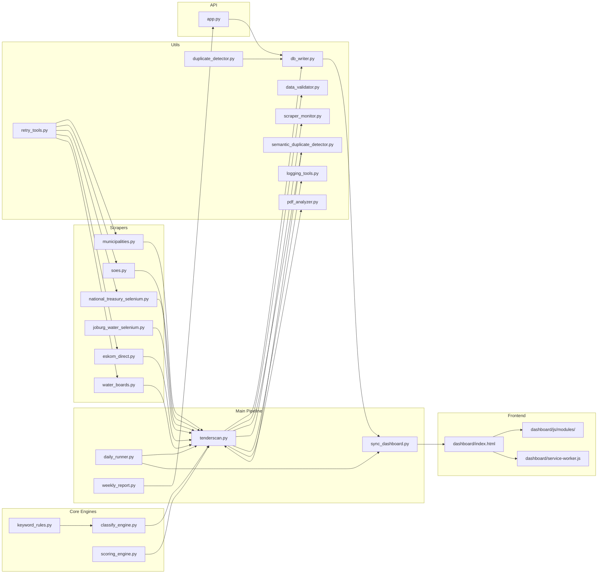

---

## Data Flow Pipeline

### End-to-End Pipeline

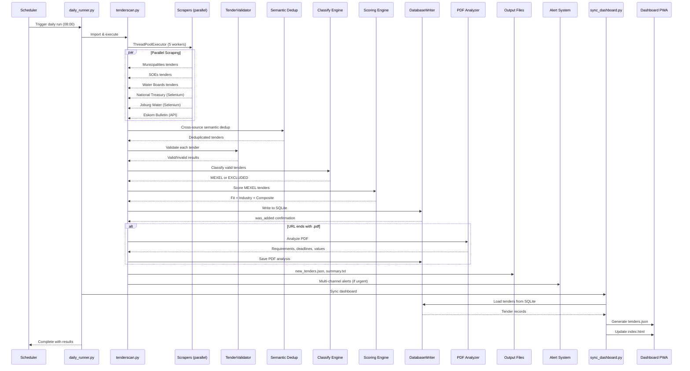

### Tender Lifecycle State Machine

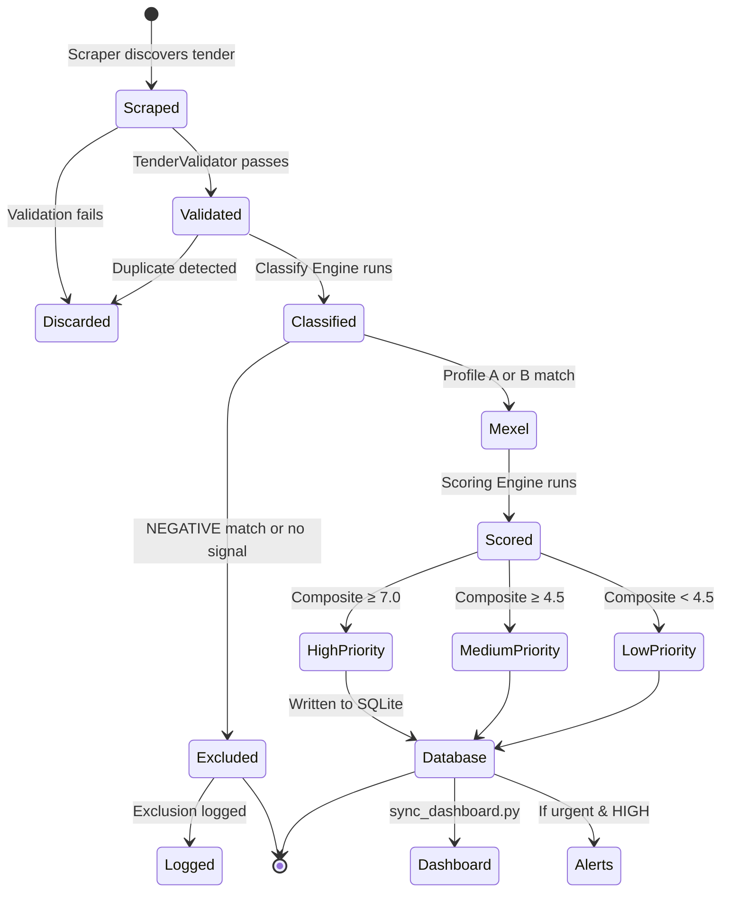

---

## Component Deep Dive

### Scraping Layer

The scraping layer consists of **6 active scraper modules** that extract tender data from South African government and SOE portals. Each scraper returns a standardized dictionary format.

#### Scraper Architecture

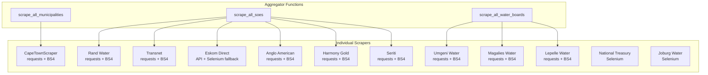

#### Scraper Comparison Table

| Scraper | Source | Method | Pagination | Auth | Status |
|---------|--------|--------|------------|------|--------|
| `municipalities.py` | Cape Town | requests + BS4 | Single page | None | ✅ Active |
| `soes.py` (Rand Water) | randwater.co.za | requests + BS4 | 3 pages | None | ✅ Active |
| `soes.py` (Transnet) | etenders.gov.za | requests + BS4 | Single page | None | ✅ Active |
| `eskom_direct.py` | tenderbulletin.eskom.co.za | REST API → Selenium | 10 pages | None | ✅ Active |
| `soes.py` (Anglo) | angloamerican.com | requests + BS4 | Single page | None | ✅ Active |
| `soes.py` (Harmony) | harmony.co.za | requests + BS4 | Single page | None | ✅ Active |
| `soes.py` (Seriti) | seritiza.com | requests + BS4 | Single page | None | ✅ Active |
| `water_boards.py` (Umgeni) | umngeni-uthukela.co.za | requests + BS4 | Single page | None | ✅ Active |
| `water_boards.py` (Magalies) | magalieswater.co.za | requests + BS4 | Single page | None | ✅ Active |
| `water_boards.py` (Lepelle) | lepellewater.co.za | requests + BS4 | Single page | None | ✅ Active |
| `national_treasury_selenium.py` | etenders.gov.za | Selenium (Chrome) | Multi-page | None | ✅ Active |
| `joburg_water_selenium.py` | johannesburgwater.co.za | Selenium (DataTables) | Single page | None | ✅ Active |

#### Standardized Tender Schema

Every scraper returns dictionaries with these fields:

```python
{
    "ref": str,           # Unique reference number
    "title": str,         # Tender title
    "description": str,   # Tender description
    "client": str,        # Issuing organization
    "source": str,        # Scraper/source name
    "url": str,           # Link to tender page
    "closing_date": str,  # ISO format date
    "category": str,      # Pre-classification (set by classify_engine)
    "reason": str,        # Classification reason
    "short_title": str,   # Sanitized title for folders
}
```

#### Resilience Pattern

All scrapers use a layered resilience approach:

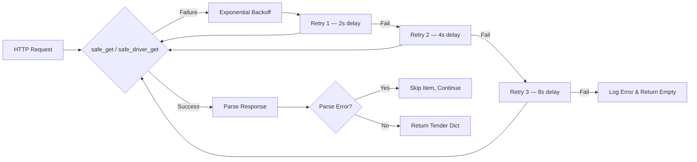

#### Parallel Execution Model

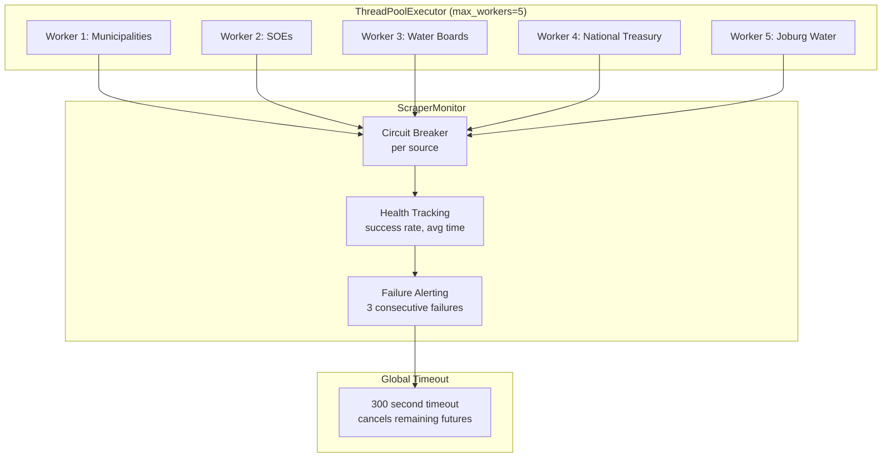

---

### Classification Engine

The classification engine (`classify_engine.py`) implements a **three-profile matching system** that determines whether a tender is relevant to Mexel's business.

#### Classification Logic Flow

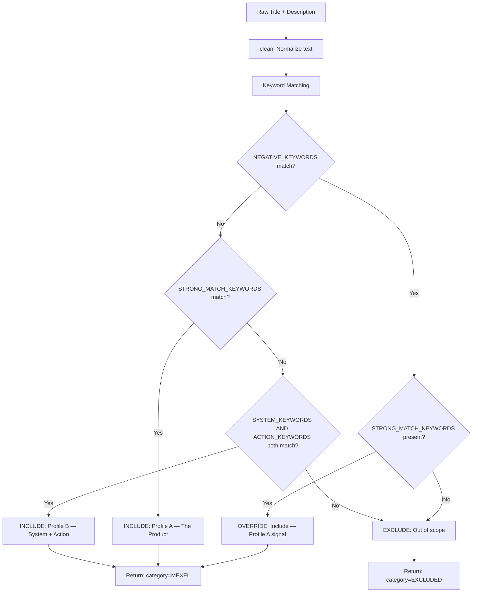

#### Keyword Profile Details

**Profile A: The Product (Automatic Match)**
These keywords represent Mexel's core technologies and services. Any match triggers immediate inclusion.

| Category | Examples |
|----------|----------|
| Brand & Product | `mexel`, `mexel 432`, `mexsteam`, `film forming amine` |
| Core Technologies | `antiscalant`, `oxidizing biocide`, `surfactant`, `ffa` |
| Service Metrics | `condenser performance`, `thermal efficiency`, `heat rate`, `back pressure` |
| Service Delivery | `iot dosing`, `automated dosing`, `precision dosing` |
| Standards | `asme ptc 12.2`, `measurement and verification`, `m&v protocol` |
| Data Center | `pue`, `power usage effectiveness`, `legionella control` |

**Profile B: System + Action (Paired Match)**
Requires BOTH a system keyword AND an action keyword to match.

| Systems (B1) | Actions (B2) |
|--------------|--------------|
| `power plant`, `power station` | `efficiency`, `optimization`, `performance improvement` |
| `cooling tower`, `condenser` | `dosing`, `treatment`, `application` |
| `boiler`, `steam generator` | `monitoring`, `performance tracking` |
| `heat exchanger`, `chiller` | `fouling`, `scaling`, `corrosion prevention` |
| `data center`, `crac`, `crah` | `baseline`, `intervention`, `restoration` |
| `smelter`, `furnace cooling` | `supply`, `delivery`, `installation` |

**Exclusions (Negative Keywords)**
Any match triggers immediate exclusion unless overridden by Profile A.

| Category | Examples |
|----------|----------|
| Construction | `construction of`, `civil works`, `structural steel` |
| Building HVAC | `split unit`, `office air conditioning`, `building hvac` |
| Non-cooling Services | `security service`, `cleaning service`, `garden service` |
| Electrical | `switchgear`, `transformer`, `substation`, `transmission` |
| Water/Wastewater | `potable water`, `drinking water`, `sewage` |
| Staffing | `resourcing`, `personnel`, `appointment of` |
| Office | `office furniture`, `painting`, `plumbing` |

#### Matched Keywords Building

The engine builds a `matched_keywords` list that includes:
1. All matched keywords from the triggering profile
2. Composite aliases (e.g., `chemical` + `dosing` → `chemical dosing`)
3. Context tokens (`industrial`, `utility`, `plant`)

---

### Scoring Engine

The scoring engine (`scoring_engine.py`) evaluates qualified tenders on two dimensions and produces a composite priority score.

#### Scoring Architecture

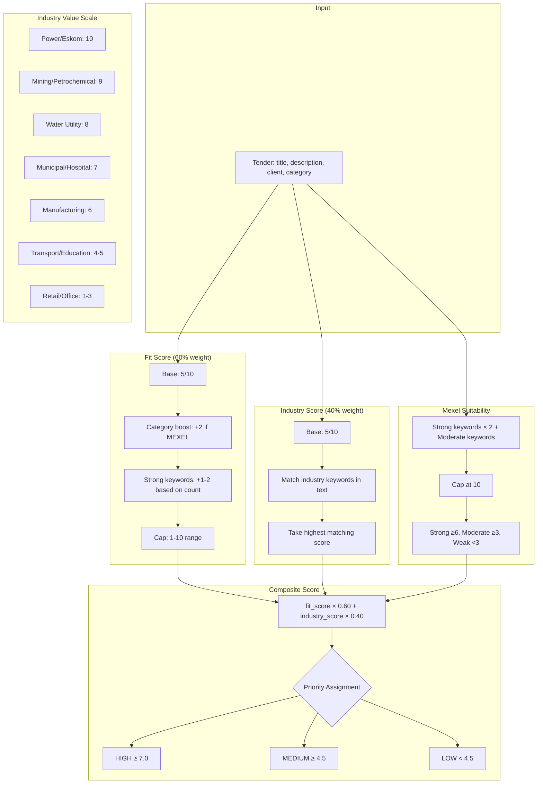

#### Composite Score Formula

```
composite = fit_score × 0.60 + industry_score × 0.40

Priority thresholds:
  HIGH   → composite ≥ 7.0
  MEDIUM → composite ≥ 4.5
  LOW    → composite < 4.5
```

#### Recommendation Engine

| Composite Score | Mexel Suitability | Recommendation |
|----------------|-------------------|----------------|
| ≥ 8.0 | Any | 🔥 PRIORITY BID — Strong fit, pursue immediately |
| 6.0–7.9 | Any | ✅ RECOMMENDED — Good opportunity, prepare bid |
| 4.0–5.9 | ≥ 6 | 📋 CONSIDER — Core capability match despite moderate score |
| 4.0–5.9 | < 6 | 📝 EVALUATE — May be worth pursuing if capacity allows |
| < 4.0 | Any | ⏭️ LOW PRIORITY — Does not align well with capabilities |

---

### Database Layer

The system uses **SQLite** as its primary storage backend, with a schema defined in `schema.sql`.

#### Entity Relationship Diagram

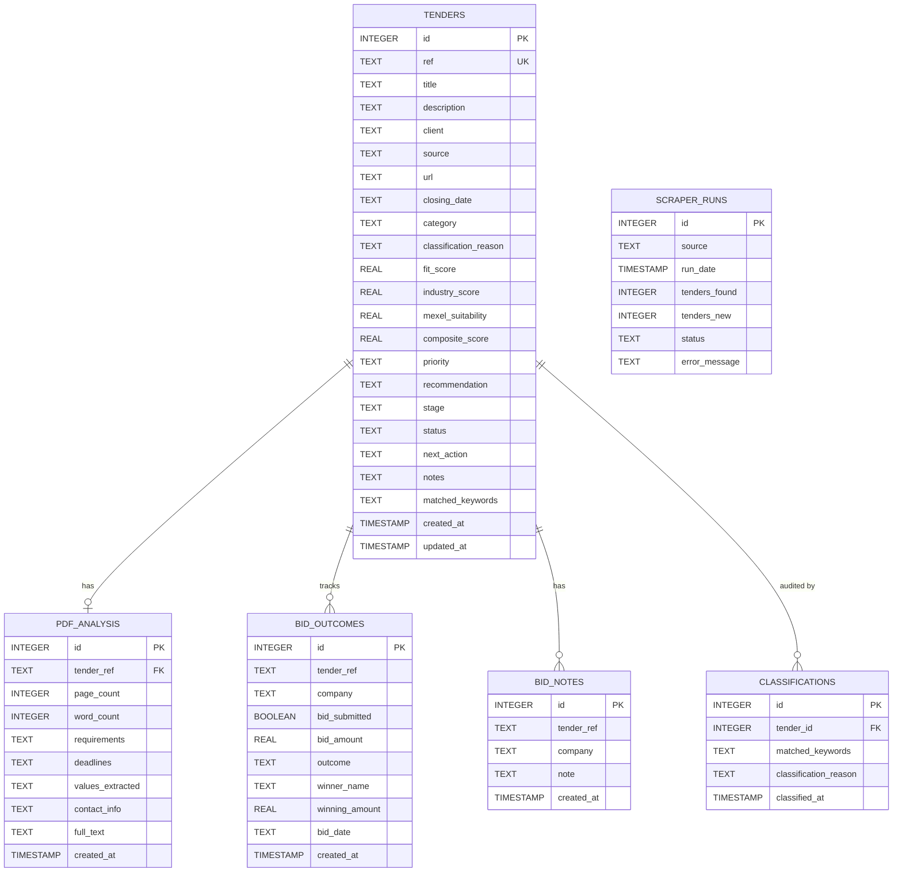

#### DatabaseWriter Class

The `DatabaseWriter` class (`utils/db_writer.py`) provides the main interface:

| Method | Purpose |
|--------|---------|
| `add_tender_with_scoring()` | Full pipeline: classify → score → write → audit trail |
| `write_tender()` | Insert single tender with duplicate guard |
| `save_pdf_analysis()` | Store PDF extraction results (UPSERT) |
| `record_bid_outcome()` | Record bid won/lost/withdrawn (UPSERT) |
| `add_bid_note()` | Append note to bid history |
| `get_recent_tenders()` | Fetch N most recent for deduplication |
| `get_stats()` | Aggregate counts by type, priority, status |
| `get_active_mexel_tenders()` | Query MEXEL tenders for dashboard |

---

### Dashboard Frontend

The dashboard is a **zero-build static PWA** served as plain HTML/CSS/JS with modular ES module architecture.

#### Frontend Architecture

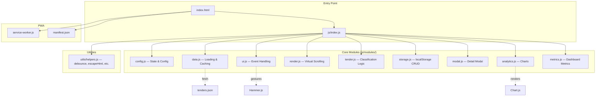

#### Key Frontend Features

| Feature | Implementation |
|---------|---------------|
| Virtual Scrolling | Renders only visible rows + 5 buffer (150px item height) |
| Smart Search | Natural language: "closes today", "next week", "urgent" |
| Three View Modes | Detailed table, Compact table, Card grid |
| Offline Support | Service worker with cache-first static, network-first data |
| Bid Calendar | Month grid with tender count indicators |
| Analytics Dashboard | Chart.js: trend line, source pie, priority bar, keyword cloud |
| Tender Detail Modal | 5 tabs: Overview, Details, Attachments, Similar, Discussion |
| Team Collaboration | Assignments, @mentions, comments, status lifecycle (8 states) |
| Export | CSV, Excel (SheetJS), PDF (jsPDF), Print |
| Persistence | localStorage for assignments, watchlists, comments, theme |

#### Data Flow in Frontend

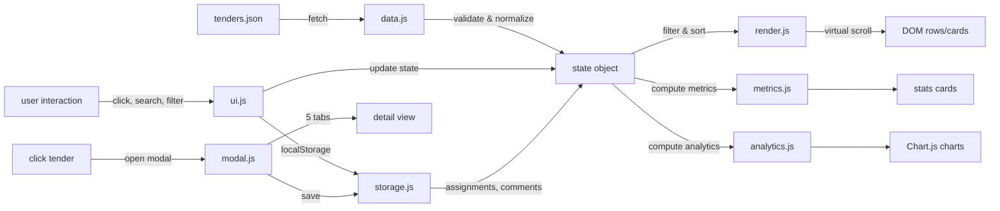

---

### Flask API

The Flask API (`app.py`) provides programmatic access to the system.

#### API Architecture

```mermaid
graph TB
    subgraph "Flask App (app.py)"
        subgraph "Public Endpoints"
            H1[/health — Health check]
            T1[/api/tenders — List tenders]
            B1[/api/stats/bids — Bid statistics]
            A1[/api/tenders/:ref/analysis — PDF analysis]
        end

        subgraph "Protected Endpoints (require_api_key)"
            S1[/api/summarize — AI summarization]
            D1[/api/run/daily — Trigger scan]
            W1[/api/run/weekly — Generate report]
            C1[/cron/daily — Cron webhook]
            C2[/cron/weekly — Cron webhook]
            R1[/api/bids — Record bid outcome]
        end

        subgraph "Middleware"
            CORS[CORS enabled]
            AUTH[API Key decorator<br/>Bearer token or X-API-Key]
        end
    end

    CORS --> H1
    CORS --> T1
    CORS --> B1
    CORS --> A1

    AUTH --> S1
    AUTH --> D1
    AUTH --> W1
    AUTH --> C1
    AUTH --> C2
    AUTH --> R1
```

#### Authentication Flow

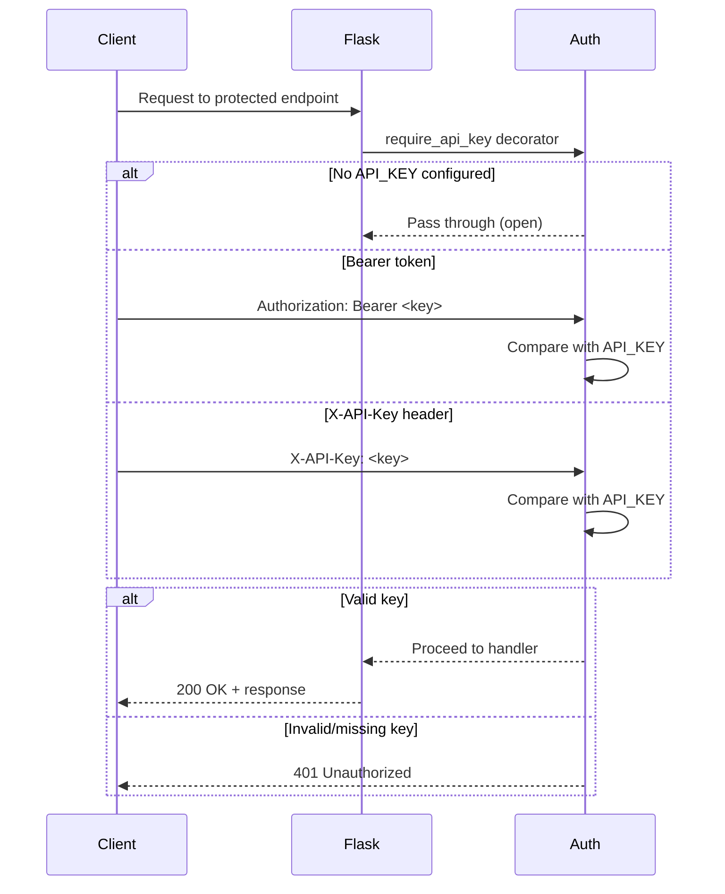

---

### Automation & Scheduling

#### Daily Workflow

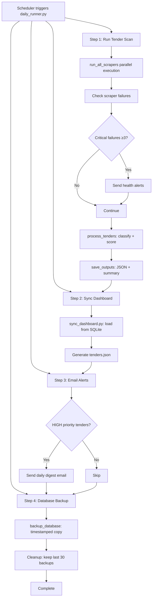

#### Weekly Report

The `weekly_report.py` generates a comprehensive HTML report with:
- Total tenders and weekly additions
- Priority distribution (HIGH/MEDIUM/LOW)
- Category breakdown with bar charts
- Closing soon tenders (next 7 days)
- Top high-priority opportunities
- Scraper health status table
- Top industries

#### Scheduling Options

| Method | Platform | Configuration |
|--------|----------|---------------|
| launchd | macOS | `com.tenderscan.daily.plist`, `com.tenderscan.weekly.plist` |
| cron | Unix/Linux | `crontab -e` entries |
| GitHub Actions | Cloud | `.github/workflows/` |
| Flask API | Any | `/cron/daily`, `/cron/weekly` endpoints |
| Render | Cloud | `render.yaml` build/start commands |

---

## Database Schema

### Complete Schema Reference

```sql
-- Main tenders table
CREATE TABLE tenders (
    id INTEGER PRIMARY KEY AUTOINCREMENT,
    ref TEXT UNIQUE NOT NULL,
    title TEXT NOT NULL,
    description TEXT,
    client TEXT,
    source TEXT,
    url TEXT,
    closing_date TEXT,
    category TEXT,              -- MEXEL, EXCLUDED
    classification_reason TEXT,
    fit_score REAL,
    industry_score REAL,
    mexel_suitability REAL,
    composite_score REAL,
    priority TEXT,              -- HIGH, MEDIUM, LOW
    recommendation TEXT,
    stage TEXT DEFAULT 'New',
    status TEXT DEFAULT 'Open',
    next_action TEXT,
    notes TEXT,
    matched_keywords TEXT,
    created_at TIMESTAMP DEFAULT CURRENT_TIMESTAMP,
    updated_at TIMESTAMP DEFAULT CURRENT_TIMESTAMP
);

-- PDF analysis (one-to-one with tenders)
CREATE TABLE pdf_analysis (
    id INTEGER PRIMARY KEY AUTOINCREMENT,
    tender_ref TEXT UNIQUE NOT NULL,
    page_count INTEGER,
    word_count INTEGER,
    requirements TEXT,          -- JSON array
    deadlines TEXT,             -- JSON array
    values_extracted TEXT,      -- JSON array
    contact_info TEXT,          -- JSON object
    full_text TEXT,
    created_at TIMESTAMP DEFAULT CURRENT_TIMESTAMP
);

-- Bid outcomes (tracks submission results)
CREATE TABLE bid_outcomes (
    id INTEGER PRIMARY KEY AUTOINCREMENT,
    tender_ref TEXT NOT NULL,
    company TEXT NOT NULL,
    bid_submitted BOOLEAN DEFAULT 0,
    bid_amount REAL,
    outcome TEXT NOT NULL,      -- won, lost, withdrawn, no_bid
    winner_name TEXT,
    winning_amount REAL,
    bid_date TEXT,
    created_at TIMESTAMP DEFAULT CURRENT_TIMESTAMP,
    UNIQUE(tender_ref, company)
);

-- Bid notes (free-form annotations)
CREATE TABLE bid_notes (
    id INTEGER PRIMARY KEY AUTOINCREMENT,
    tender_ref TEXT NOT NULL,
    company TEXT NOT NULL,
    note TEXT NOT NULL,
    created_at TIMESTAMP DEFAULT CURRENT_TIMESTAMP
);

-- Classification audit trail
CREATE TABLE classifications (
    id INTEGER PRIMARY KEY AUTOINCREMENT,
    tender_id INTEGER,
    matched_keywords TEXT,
    classification_reason TEXT,
    classified_at TIMESTAMP DEFAULT CURRENT_TIMESTAMP,
    FOREIGN KEY (tender_id) REFERENCES tenders(id)
);

-- Scraper run monitoring
CREATE TABLE scraper_runs (
    id INTEGER PRIMARY KEY AUTOINCREMENT,
    source TEXT,
    run_date TIMESTAMP DEFAULT CURRENT_TIMESTAMP,
    tenders_found INTEGER,
    tenders_new INTEGER,
    status TEXT,
    error_message TEXT
);

-- Performance indexes
CREATE INDEX idx_tenders_ref ON tenders(ref);
CREATE INDEX idx_tenders_priority ON tenders(priority);
CREATE INDEX idx_tenders_category ON tenders(category);
CREATE INDEX idx_tenders_closing_date ON tenders(closing_date);
CREATE INDEX idx_tenders_created_at ON tenders(created_at);
```

---

## Configuration & Environment

### Configuration Hierarchy

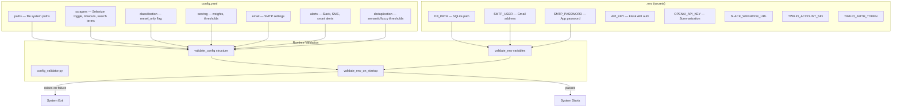

### Key Configuration Values

| Setting | Default | Description |
|---------|---------|-------------|
| `scoring.fit_weight` | 0.60 | Fit score weight in composite |
| `scoring.industry_weight` | 0.40 | Industry score weight in composite |
| `scoring.high_threshold` | 7.0 | Composite score for HIGH priority |
| `scoring.medium_threshold` | 4.5 | Composite score for MEDIUM priority |
| `scrapers.enable_selenium` | true | Toggle Selenium-based scrapers |
| `deduplication.semantic_threshold` | 0.75 | ML similarity threshold |
| `deduplication.fuzzy_threshold` | 85 | Fuzzy string match threshold |
| `deduplication.date_window_days` | 7 | Date proximity window for dedup |
| `alerts.urgent_threshold_days` | 3 | Days until closing for urgent alert |

---

## Security Model

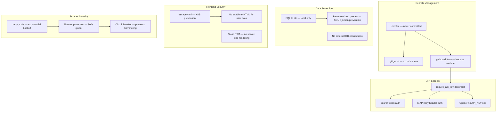

### Security Checklist

| Area | Measure | Status |
|------|---------|--------|
| Secrets | `.env` in `.gitignore`, loaded via `python-dotenv` | ✅ |
| API Auth | Bearer token / X-API-Key decorator | ✅ |
| SQL Injection | Parameterized queries throughout | ✅ |
| XSS | `escapeHtml()` in frontend, no innerHTML for user data | ✅ |
| Scraper Resilience | Exponential backoff, circuit breaker, timeouts | ✅ |
| File Access | Local-only SQLite, no external connections | ✅ |
| CORS | Configured for Flask API endpoints | ✅ |

---

## Testing & CI/CD

### Test Infrastructure

```mermaid
graph TB
    subgraph "Backend Tests"
        B1[pytest — Python test runner]
        B2[pytest.ini — Configuration]
        B3[test_scoring_v2.py — Scoring tests]
        B4[test_exclusions.py — Classification tests]
        B5[test_hvac_keywords.py — HVAC keyword tests]
        B6[test_scrapers_direct.py — Scraper tests]
        B7[run_tests.py — Test runner]
    end

    subgraph "Frontend Tests"
        F1[Vitest — JS test runner]
        F2[vitest.config.js — Configuration]
        F3[tests/tender.test.js — Classification logic]
        F4[tests/helpers.test.js — Utility functions]
        F5[tests/setup.js — Mocks: localStorage, fetch, Chart]
    end

    subgraph "CI/CD Pipeline"
        C1[.github/workflows/test-and-lint.yml]
        C2[Ruff — Linter (120 char line limit)]
        C3[Pytest — Unit tests]
        C4[Codecov — Coverage reporting]
        C5[deploy-staging.yml — Staging deploy]
        C6[update-dashboard-tenders.yml — Dashboard sync]
    end

    B1 --> B2
    B3 --> B1
    B4 --> B1
    B5 --> B1
    B6 --> B1
    B7 --> B1

    F1 --> F2
    F3 --> F1
    F4 --> F1
    F5 --> F1

    C1 --> C2
    C1 --> C3
    C3 --> C4
    C1 --> C5
    C1 --> C6
```

### CI/CD Workflows

| Workflow | Trigger | Actions |
|----------|---------|---------|
| `test-and-lint.yml` | Push/PR to `main` | Ruff lint → Pytest → Codecov upload |
| `deploy-staging.yml` | Push to `main` | Deploy to staging environment |
| `update-dashboard-tenders.yml` | Schedule / Push | Sync dashboard data files |

### Test Commands

```bash
# Backend tests
python run_tests.py
python -m pytest tests/ -v

# Frontend tests
cd dashboard && npm test
cd dashboard && npm run test:coverage
cd dashboard && npm run test:ui

# Linting
ruff check .
cd dashboard && npm run lint
```

---

## Deployment Architecture

### Deployment Options

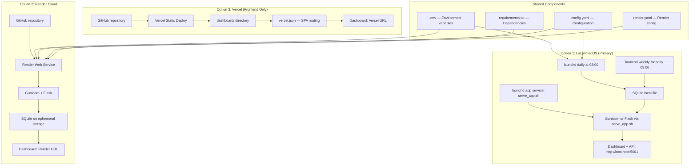

### Local macOS Automation

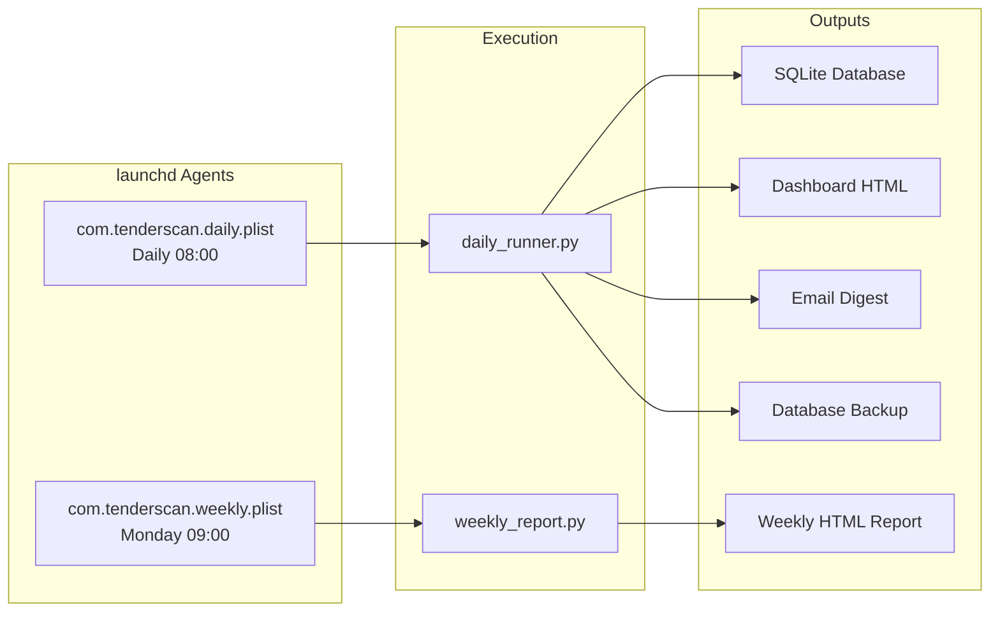

---

## Developer Guide

### Project Structure

```
tender-intelligence/
├── tenderscan.py              # Main orchestration engine
├── classify_engine.py         # Classification logic (Profile A/B)
├── scoring_engine.py          # Composite scoring algorithm
├── keyword_rules.py           # Keyword definitions (STRONG, SYSTEM, ACTION, NEGATIVE)
├── sync_dashboard.py          # Dashboard data sync (SQLite → JSON)
├── daily_runner.py            # Daily workflow orchestrator
├── weekly_report.py           # Weekly HTML report generator
├── app.py                     # Flask API server
│
├── scrapers/                  # Data source scrapers
│   ├── municipalities.py      # Cape Town municipality
│   ├── soes.py               # State-owned enterprises aggregator
│   ├── national_treasury_selenium.py  # eTenders (Selenium)
│   ├── joburg_water_selenium.py       # Johannesburg Water (Selenium)
│   ├── eskom_direct.py       # Eskom tender bulletin (API + Selenium)
│   ├── water_boards.py       # Water boards aggregator
│   ├── national_treasury.py  # eTenders API (unused)
│   ├── eskom.py              # Eskom via eTenders API (deprecated)
│   ├── transnet.py           # Transnet via eTenders API (disabled)
│   └── sadc.py               # SADC regional tenders
│
├── utils/                     # Shared utilities
│   ├── db_writer.py          # SQLite database operations
│   ├── excel_writer.py       # Excel operations (legacy)
│   ├── data_validator.py     # Tender data validation
│   ├── duplicate_detector.py # Fuzzy string deduplication
│   ├── semantic_duplicate_detector.py  # ML-based dedup
│   ├── pdf_analyzer.py       # PDF content extraction
│   ├── scraper_monitor.py    # Circuit breaker & health tracking
│   ├── retry_tools.py        # HTTP retry with backoff
│   ├── logging_tools.py      # Thread-safe logging
│   ├── folder_tools.py       # Tender folder creation
│   ├── bid_tracker.py        # Bid outcome tracking
│   ├── multi_channel_alerts.py  # Slack/SMS alerts
│   ├── email_alerts.py       # Email notifications
│   ├── config_validator.py   # Config & env validation
│   ├── backup_database.py    # SQLite backup with rotation
│   ├── text_cleaner.py       # Text normalization
│   ├── text_utils.py         # Date parsing, text utilities
│   └── pdf_tools.py          # PDF metadata detection
│
├── dashboard/                 # Static PWA frontend
│   ├── index.html            # Main dashboard page
│   ├── style.css             # Styles
│   ├── manifest.json         # PWA manifest
│   ├── service-worker.js     # Offline support
│   ├── tenders.json          # Client-side data (generated)
│   ├── js/                   # Modular JavaScript
│   │   ├── index.js          # Entry point
│   │   ├── modules/          # Core modules
│   │   │   ├── config.js     # State & configuration
│   │   │   ├── data.js       # Data loading & caching
│   │   │   ├── ui.js         # Event handling & theme
│   │   │   ├── render.js     # Virtual scrolling
│   │   │   ├── tender.js     # Classification logic
│   │   │   ├── storage.js    # localStorage CRUD
│   │   │   ├── modal.js      # Detail modal
│   │   │   ├── analytics.js  # Charts & analytics
│   │   │   └── metrics.js    # Dashboard metrics
│   │   └── utils/
│   │       └── helpers.js    # Utility functions
│   └── tests/                # Frontend tests
│
├── data/                      # SQLite database
│   └── tenders.db
│
├── output/                    # Generated outputs
│   ├── new_tenders.json      # Latest tenders
│   ├── summary.txt           # Scan summary
│   └── scraper_health.json   # Scraper health report
│
├── reports/                   # Weekly reports
├── backups/                   # Database backups
├── logs/                      # Scraper logs
│
├── config.yaml               # Main configuration
├── schema.sql                # Database schema
├── requirements.txt          # Python dependencies
├── .env.example              # Environment template
└── Launch Dashboard.command  # macOS launcher
```

### Adding a New Scraper

1. Create `scrapers/my_source.py`
2. Implement a function that returns `List[Dict]` with the standard schema
3. Use `utils.retry_tools.safe_get()` for HTTP requests
4. Call `classify_engine.classify_tender()` for classification
5. Add the scraper to `tenderscan.py:run_all_scrapers()`
6. Test with: `python -c "from scrapers.my_source import scrape_my_source; print(len(scrape_my_source()))"`

### Modifying Classification Rules

1. Edit `keyword_rules.py` — add/remove keywords from the appropriate list
2. Test with: `python -c "from classify_engine import classify_tender; print(classify_tender('Test Title', 'Test Description'))"`
3. Run `python tenderscan.py` to reclassify existing tenders

### Adjusting Scoring Weights

1. Edit `config.yaml` → `scoring:` section
2. Modify `scoring_engine.py` for algorithm changes
3. Test with: `python scoring_engine.py` (runs built-in tests)

---

## Glossary

| Term | Definition |
|------|------------|
| **Mexel Energy Sustain** | Client company — thermal efficiency services for power generation and industrial cooling |
| **Profile A** | Classification profile — direct product/technology match (automatic include) |
| **Profile B** | Classification profile — system + action keyword pair match (must both be present) |
| **Composite Score** | Weighted average of fit score (60%) and industry score (40%) |
| **Fit Score** | How well a tender matches Mexel's core capabilities (1-10) |
| **Industry Score** | Value of the client's industry to Mexel (1-10) |
| **Mexel Suitability** | Product-specific fit score based on keyword density (0-10) |
| **Semantic Deduplication** | ML-based duplicate detection using sentence embeddings |
| **Circuit Breaker** | Pattern that disables scrapers after consecutive failures |
| **PWA** | Progressive Web App — installable, offline-capable web application |
| **Virtual Scrolling** | Rendering only visible DOM elements for performance |
| **launchd** | macOS service manager for scheduled tasks |
| **SOE** | State-Owned Enterprise (Eskom, Transnet, Rand Water, etc.) |
| **TES** | Thermal Efficiency Services — Mexel's core business line |

---

## System Health Monitoring

```mermaid
graph TB
    subgraph "ScraperMonitor"
        M1[Per-source metrics]
        M2[Success rate tracking]
        M3[Consecutive failure count]
        M4[Average tenders per run]
        M5[Average duration]
    end

    subgraph "Circuit Breaker"
        C1[Threshold: 3 consecutive failures]
        C2[Cooldown: 3600 seconds]
        C3[CircuitOpenError — skip scraper]
    end

    subgraph "Alerting"
        A1[Should alert? — threshold check]
        A2[Mark alerted — prevent duplicates]
        A3[Slack webhook]
        A4[SMS via Twilio]
        A5[Email digest]
    end

    subgraph "Health Report"
        H1[output/scraper_health.json]
        H2[Weekly report scraper table]
        H3[Dashboard source health cards]
    end

    M1 --> C1
    M2 --> C1
    M3 --> C1
    C1 --> C3
    C1 --> C2
    C3 --> A1
    A1 --> A2
    A2 --> A3
    A2 --> A4
    A2 --> A5

    M1 --> H1
    M2 --> H2
    M4 --> H3
```

---

*This document was auto-generated by exploring the complete codebase. For implementation details, refer to the source files directly.*
