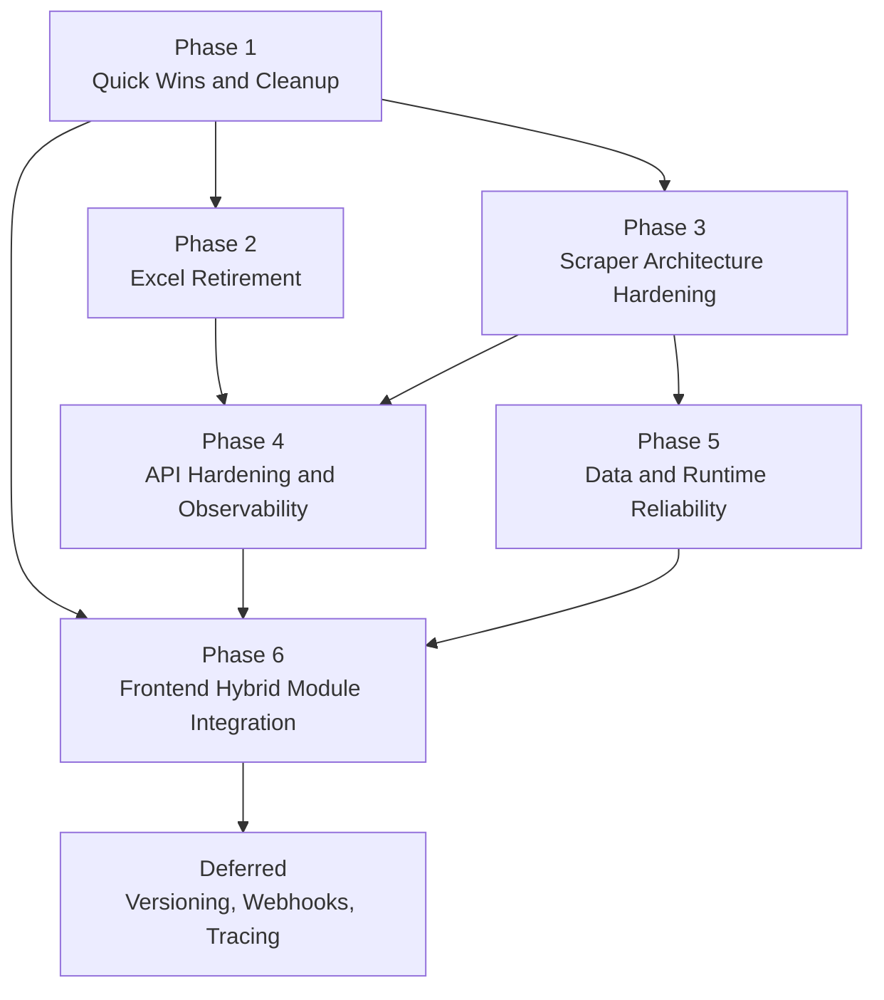
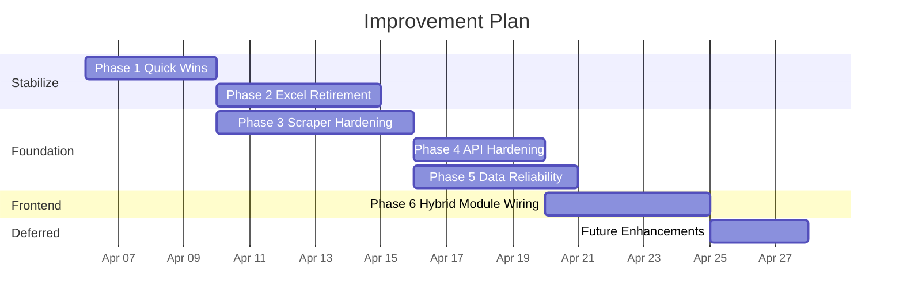
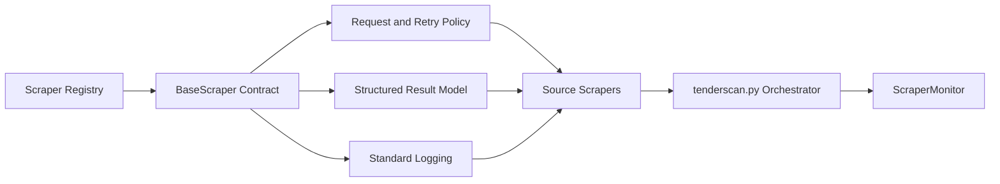

# Tender Intelligence Repository Improvement Plan

> Last updated: 2026-04-05
> Scope: prioritized implementation plan for the architecture, developer-experience, API, data, and frontend improvements identified during repository review
> Decision status: Excel legacy support will be removed, frontend module migration will use a hybrid path, Docker will be skipped

## Purpose

This document converts the previously identified improvement ideas into an implementation-ready roadmap grounded in the current state of the repository.

It is not a product expansion roadmap. It is a technical stabilization and modernization plan for the existing Tender Intelligence system.

## Locked Decisions

### 1. Excel legacy support

Decision: remove entirely.

Implication:
- `weekly_report.py` must stop reading from Excel first.
- email/report attachments that currently depend on the Excel workbook must be redesigned before `utils/excel_writer.py` and related scripts are removed.
- there will be no long-term dual-write mode.

### 2. Frontend ES modules

Decision: hybrid migration.

Implication:
- keep the modular code in `dashboard/js/` as the source of truth.
- introduce a thin compatibility bridge so existing inline handlers in `dashboard/index.html` keep working while behavior moves into modules.
- avoid a big-bang rewrite of the dashboard page.

### 3. Docker

Decision: skip.

Implication:
- deployment and local operations remain file-based and scheduler-based.
- effort should go into reliability, observability, and documentation instead of containerization.

## Verified Baseline

The plan below is based on the current repository state, not on assumptions.

### Confirmed findings

- `keyword_rules.py` contains duplicated `SYSTEM_KEYWORDS` entries for cooling-related terms.
- `sync_dashboard.py` contains a dead `generate_dashboard_html()` path that returns `"HTML_PLACEHOLDER"` while `sync()` actually writes `dashboard/tenders.json`.
- `weekly_report.py` still reads the Excel workbook directly with `openpyxl` and attaches the workbook to email.
- `utils/excel_writer.py` is still present and documented as being replaced by `utils/db_writer.py`.
- `scrapers/soes.py` contains repeated import fallback logic for `joburg_water_selenium` and relies on implicit/dynamic scraper wiring.
- `dashboard/js/index.js` exists and exports compatibility functions to `window`, but `dashboard/index.html` still uses many inline `onclick` handlers.
- `app.py` has protected endpoints but no request schema validation and no rate limiting.
- `schema.sql` creates tables idempotently but there is no schema versioning or migration system.
- `utils/semantic_duplicate_detector.py` caches the embedding model per process, but duplicate checks still recompute embeddings repeatedly during pairwise comparisons.
- `.env.example`, `weekly_report.py`, and `utils/email_alerts.py` are not aligned on environment variable names.

### Non-goals for this plan

- no Docker work
- no large UI redesign
- no rewrite to a different backend framework
- no major product expansion unless it directly supports the existing roadmap

## Prioritization Principles

Work is ordered by the following rule set:

1. Remove ambiguity before adding structure.
2. Migrate live dependencies before deleting legacy components.
3. Standardize scraper behavior before expanding scraper features.
4. Harden public API surfaces before adding new API surface area.
5. Prefer incremental compatibility layers over high-risk rewrites.

## Roadmap Overview





## Phase Summary

| Phase | Goal | Estimated Effort | Risk | Blocking Dependencies |
| --- | --- | --- | --- | --- |
| 1 | Remove low-value ambiguity and obvious defects | 1-2 days | Low | None |
| 2 | Retire Excel safely and fully | 2-3 days | Medium | Phase 1 |
| 3 | Normalize scraper architecture and error handling | 3-4 days | Medium | Phase 1 |
| 4 | Harden API contracts and operational visibility | 2-3 days | Medium | Phase 3 |
| 5 | Add migration and runtime reliability foundations | 2-3 days | Medium | Phase 3 |
| 6 | Complete the hybrid frontend integration path | 2-3 days | Medium | Phases 1 and 4 |
| Deferred | Nice-to-have extensibility work | As needed | Low | Earlier phases complete |

## Phase 1: Quick Wins and Cleanup

### Objective

Remove confusing or misleading code paths, align configuration surfaces, and fix issues that have low risk and immediate payoff.

### Tasks

#### 1.1 Remove duplicate keyword entries

Files:
- `keyword_rules.py`

Actions:
- deduplicate repeated cooling-system terms in `SYSTEM_KEYWORDS`
- add a small regression test asserting no duplicates in the configured keyword lists

Why first:
- zero architectural dependency
- avoids noise in classification maintenance

Acceptance criteria:
- keyword lists contain no exact duplicate entries
- tests cover duplicate detection

#### 1.2 Remove or neutralize dead dashboard HTML generation code

Files:
- `sync_dashboard.py`
- `CLAUDE.md`
- `ARCHITECTURE.md` if it references static HTML generation behavior

Actions:
- either delete `generate_dashboard_html()` entirely or rewrite its docstring/comments to make clear it is unused
- update any documentation that still claims dashboard HTML is generated by `sync_dashboard.py`

Why first:
- current behavior is misleading
- it creates false architectural expectations for later work

Acceptance criteria:
- there is one clear dashboard sync path
- no code path returns `"HTML_PLACEHOLDER"`

#### 1.3 Align environment variable contract

Files:
- `.env.example`
- `weekly_report.py`
- `utils/email_alerts.py`
- `utils/config_validator.py`
- `app.py`

Actions:
- choose one email env naming convention
- remove mixed use of `SMTP_*`, `EMAIL_*`, and `TENDERSCAN_*` names where possible
- document the final contract in `.env.example`

Why first:
- configuration drift currently increases operational error rate
- Phase 2 depends on a clean reporting/email configuration story

Acceptance criteria:
- `.env.example` documents all active env vars
- config validation matches the actual code paths
- weekly and daily email paths read from the same contract

#### 1.4 Clean package surfaces

Files:
- `scrapers/__init__.py`
- `utils/__init__.py`

Actions:
- add explicit `__all__` exports for supported public modules if package imports are intended
- otherwise document that packages are internal-only and avoid pretending they provide a curated API

Acceptance criteria:
- package boundaries are intentional rather than empty placeholders

#### 1.5 Minor code hygiene fixes

Files:
- `scrapers/soes.py`
- selected scraper files

Actions:
- remove the repeated `joburg_water_selenium` import fallback block
- add missing docstrings where scraper entrypoints are unclear
- replace broad `except: pass` blocks in obvious low-risk spots with minimal logging

Acceptance criteria:
- no duplicated import fallback blocks remain
- scraper entrypoints have clear purpose and usage comments

### Phase 1 deliverables

- a smaller, less misleading codebase
- a single documented configuration contract
- cleaner groundwork for the risky phases

### Phase 1 verification

```bash
pytest tests test_hvac_keywords.py tests/test_keyword_rules.py
python -m py_compile app.py weekly_report.py sync_dashboard.py
```

## Phase 2: Excel Retirement

### Objective

Finish the database transition and remove Excel as an operational dependency.

### Why this is Phase 2

Excel removal was the strongest architectural decision made after review, but the repo is not ready for immediate deletion because reporting still depends on the workbook.

### Tasks

#### 2.1 Move weekly reporting to SQLite

Files:
- `weekly_report.py`
- `schema.sql`
- `utils/db_writer.py` if helper reads are needed

Actions:
- replace workbook iteration with SQL queries against `tenders`, `bid_outcomes`, and `scraper_runs`
- compute the same weekly summary directly from the database
- preserve current HTML output semantics where practical

Acceptance criteria:
- `weekly_report.py` runs without `openpyxl`
- weekly statistics match the current report within acceptable tolerance

#### 2.2 Redesign weekly report attachments

Files:
- `weekly_report.py`

Actions:
- stop attaching the Excel workbook
- attach the generated HTML report only, or optionally emit a CSV export from SQLite if stakeholders still need a downloadable table

Acceptance criteria:
- weekly email remains useful without any Excel artifact

#### 2.3 Remove Excel writer and Excel maintenance scripts

Likely files:
- `utils/excel_writer.py`
- `force_sync_excel.py`
- `inspect_excel.py`
- `migrate_excel_to_sqlite.py`
- `dashboard/execution/verify_excel_structure.py`
- any remaining Excel-only tooling that is no longer part of production flow

Actions:
- remove obsolete files or move them to an `archive/` area if historical retention matters
- update docs that still advertise Excel as an active storage path

Acceptance criteria:
- SQLite is the only operational source of truth
- `requirements.txt` no longer needs `openpyxl` unless another active runtime path still requires it

#### 2.4 Remove Excel-first configuration requirements

Files:
- `config.yaml`
- `utils/config_validator.py`
- docs referencing `paths.tender_log_excel`

Actions:
- deprecate and remove required Excel path configuration
- ensure config validation no longer blocks startup because of Excel-only settings

Acceptance criteria:
- a fresh setup can run without any Excel path configured

### Phase 2 risks

- weekly report behavior may drift if SQL logic does not match historical workbook semantics
- stakeholders may still expect an attached spreadsheet

### Phase 2 mitigation

- compare one historical weekly report generated from Excel versus SQLite before deleting workbook logic
- if a tabular artifact is still required, generate CSV from SQLite rather than preserving Excel code

### Phase 2 verification

```bash
python weekly_report.py
pytest tests
rg -n "openpyxl|Tender_Dashboard_v2.xlsx|tender_log_excel"
```

## Phase 3: Scraper Architecture Hardening

### Objective

Standardize scraper contracts, make dependencies explicit, and remove deprecated scraper ambiguity.

### Current problem

The scraping layer works, but it is assembled from a mix of:
- direct imports
- dynamic imports
- duplicate implementations
- inconsistent exception handling
- source-specific conventions for logging and return shape

### Target architecture



### Tasks

#### 3.1 Introduce a `BaseScraper` contract

Likely files:
- new `scrapers/base.py`
- `scrapers/*.py`

Actions:
- define a standard scraper interface
- standardize return shape, metadata, and error reporting
- centralize request headers, retry behavior, and timeout defaults where possible

Acceptance criteria:
- every active scraper conforms to one explicit contract

#### 3.2 Replace implicit scraper wiring with an explicit registry

Files:
- `tenderscan.py`
- `scrapers/__init__.py`
- possibly new `scrapers/registry.py`

Actions:
- replace late `__import__` calls and ad-hoc lambda wrappers with a registry of active scrapers
- make Selenium-backed scrapers explicit feature-flagged entries

Acceptance criteria:
- the orchestrator has one authoritative list of active scrapers
- import errors are surfaced clearly

#### 3.3 Archive or remove deprecated scrapers

Likely files:
- `scrapers/eskom.py`
- `scrapers/transnet.py`
- `scrapers/national_treasury.py`

Actions:
- confirm which implementations are truly inactive
- move obsolete ones into `archive/scrapers/` or remove them if history is not needed
- document the canonical scraper for each source

Acceptance criteria:
- there is only one supported implementation per active source
- deprecated files are not discoverable as if they were production code

#### 3.4 Standardize error handling and run reporting

Files:
- `scrapers/*.py`
- `utils/logging_tools.py`
- `utils/scraper_monitor.py`

Actions:
- remove silent `except` blocks from active scraper flows
- emit consistent error context including source, URL, stage, and elapsed time
- ensure all scraper failures are represented in run-monitoring output

Acceptance criteria:
- scraper failures are diagnosable from logs and monitoring output

### Phase 3 verification

```bash
pytest tests test_scrapers_direct.py
python tenderscan.py
```

## Phase 4: API Hardening and Observability

### Objective

Protect the Flask API against malformed inputs, abuse, and weak operational visibility.

### Tasks

#### 4.1 Add request validation

Files:
- `app.py`
- possibly new `api/schemas.py` or `models.py`

Actions:
- define request schemas for `/api/summarize` and `/api/bids`
- validate required fields, enum values, payload sizes, and dates
- return stable 4xx responses on client errors

Recommendation:
- use Pydantic or a lightweight equivalent

Acceptance criteria:
- malformed requests do not reach database or external API calls

#### 4.2 Add rate limiting

Files:
- `app.py`
- `requirements.txt`

Actions:
- protect expensive and write-heavy routes with sensible limits
- apply stricter limits to summarization and run-trigger endpoints

Acceptance criteria:
- public exposure of the API has basic abuse protection

#### 4.3 Improve `/health`

Files:
- `app.py`
- `utils/scraper_monitor.py`

Actions:
- enrich `/health` with database reachability, row counts, last successful runs, and circuit states where available
- keep a lightweight response format for automation

Acceptance criteria:
- the health endpoint is operationally meaningful rather than just descriptive

#### 4.4 Introduce structured logging

Files:
- `utils/logging_tools.py`
- call sites in `tenderscan.py`, `daily_runner.py`, `app.py`, and scraper modules

Actions:
- keep existing human-readable logging as default if needed
- add optional JSON log mode with fields like `timestamp`, `level`, `component`, `source`, `ref`, and `duration_ms`

Acceptance criteria:
- logs can be machine-parsed when running in production-style environments

### Phase 4 verification

```bash
pytest tests
python -m py_compile app.py
```

## Phase 5: Data and Runtime Reliability

### Objective

Add the missing database and runtime foundations that make ongoing change safe.

### Tasks

#### 5.1 Introduce schema migrations

Files:
- `schema.sql`
- new `migrations/` directory or migration runner
- `utils/db_writer.py`

Actions:
- add schema version tracking
- stop relying on `CREATE TABLE IF NOT EXISTS` alone for future evolution
- create migration rules for additive changes and data backfills

Acceptance criteria:
- schema changes become explicit, ordered, and reversible

#### 5.2 Improve semantic deduplication efficiency

Files:
- `utils/semantic_duplicate_detector.py`
- `tenderscan.py`

Actions:
- batch or cache embedding generation for collections instead of recomputing per comparison
- reduce repeated encoding of historical tenders during a single run
- add timing instrumentation so performance regressions are visible

Acceptance criteria:
- duplicate detection runtime is materially reduced on larger tender sets

#### 5.3 Strengthen runtime metadata

Files:
- `schema.sql`
- `utils/scraper_monitor.py`
- `daily_runner.py`

Actions:
- ensure scraper runs, durations, failure counts, and alerts are persisted cleanly
- define the authoritative source of operational truth between JSON outputs and DB tables

Acceptance criteria:
- health reporting and weekly reporting both rely on coherent runtime data

### Phase 5 verification

```bash
pytest tests
python tenderscan.py
```

## Phase 6: Frontend Hybrid Module Integration

### Objective

Finish the ongoing frontend modularization without destabilizing the dashboard.

### Current problem

The repository contains a credible modular JS architecture, but `dashboard/index.html` still owns much of the app behavior through inline handlers and embedded logic. The codebase is split between two truths.

### Tasks

#### 6.1 Make the module entrypoint authoritative

Files:
- `dashboard/index.html`
- `dashboard/js/index.js`

Actions:
- load `dashboard/js/index.js` as the main browser entrypoint with `type="module"`
- keep a short compatibility bridge that exposes only the globals still needed by inline HTML

Acceptance criteria:
- the page bootstraps from module code, not from large inline scripts

#### 6.2 Gradually remove inline handlers

Files:
- `dashboard/index.html`
- `dashboard/js/modules/ui.js`
- `dashboard/js/modules/modal.js`
- `dashboard/js/modules/render.js`

Actions:
- move event wiring into JS modules using delegated listeners
- replace `onclick` HTML attributes incrementally

Acceptance criteria:
- inline behavior shrinks substantially without a dashboard regression

#### 6.3 Complete the "Similar" feature or explicitly defer it

Files:
- modal-related frontend modules
- backend or local similarity helper if needed

Actions:
- either implement tender similarity using the existing semantic machinery
- or hide/remove placeholder UI until supported

Acceptance criteria:
- the UI does not advertise a non-functional capability

### Phase 6 verification

```bash
cd dashboard && npm test
cd dashboard && npm run lint
cd dashboard && npm run typecheck
```

## Deferred Work

These items are valid, but they should not be started before the earlier phases are complete.

### Deferred 1: API versioning

Reason to defer:
- useful only after request validation and endpoint contracts settle

### Deferred 2: Webhooks

Reason to defer:
- current system first needs stronger core event and alert semantics

### Deferred 3: OpenTelemetry tracing

Reason to defer:
- structured logging and run metadata should exist before adding tracing complexity

### Deferred 4: Docker

Status:
- explicitly out of scope

## Recommended Execution Order

1. Execute Phase 1 completely.
2. Start Phase 2 immediately after Phase 1 because Excel removal affects architecture, config, reporting, and dependencies.
3. Execute Phase 3 next so scraper behavior is standardized before deeper API and data changes.
4. Run Phases 4 and 5 after scraper architecture is stable.
5. Finish with Phase 6 once backend contracts and data flows are settled.

## Suggested Branching Strategy

- `phase-1-cleanup`
- `phase-2-remove-excel`
- `phase-3-scraper-foundation`
- `phase-4-api-hardening`
- `phase-5-data-reliability`
- `phase-6-frontend-hybrid-modules`

This keeps rollback small and makes review simpler.

## Exit Criteria

The roadmap is complete when all of the following are true:

- SQLite is the only operational storage path.
- scraper entrypoints are explicit and standardized.
- API writes and expensive operations are validated and rate-limited.
- health and logging output are useful for operations.
- dashboard behavior is module-driven, with minimal or no inline scripting.
- deprecated code is archived or removed, not left as active-looking noise.

## First Implementation Slice

If execution starts immediately, the highest-value first slice is:

1. Deduplicate keyword lists.
2. Remove the dead `generate_dashboard_html()` placeholder path.
3. Align `.env.example`, `weekly_report.py`, and `utils/email_alerts.py`.
4. Remove duplicated import fallback logic in `scrapers/soes.py`.
5. Write a regression test pass for the above.

That slice is small, low-risk, and makes the later phases safer.
